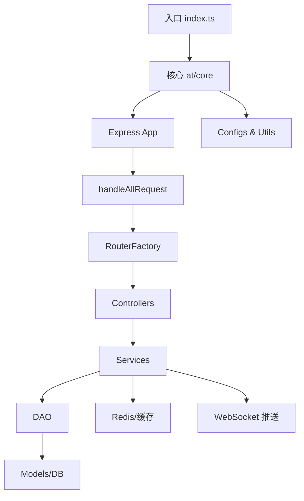

# Helpack 管控台

[Hel Pack](https://your-deployed-helpack-site.com)，海拉HelPack，动态化模块发布、托管服务

## 结构链路
- 入口脚本 `src/index.ts` 依次加载全局 `HelError`、环境配置初始化 `initAppEnvConf`、依赖初始化 `initAppLibs`、应用级监听 `initAppListeners`，最终执行 `runApp` 启动 HTTP 与 WebSocket 服务。

- `at/core/app.ts` 构建 Express 应用：配置视图引擎、静态资源、通用中间件，并串联 `handleAllRequest` 与集中式路由 `router`，形成请求总入口。

- `handleAllRequest` 负责区分 API / 页面 / 首页请求并执行自定义中间件链，再进入对应控制器；所有控制器逻辑最终由 `logicGateway.executeLogicFn` 统一包装请求上下文、服务访问、DAO、响应助手与异常处理。

- `runApp.ts` 创建 HTTP Server，初始化 hel-micro-node WebSocket 监听，落地端口监听、错误与启动事件，配合 `deploy.changeIsStartedTrue` 标记服务状态。

## 模块方法

### 核心层 `src/at/core`

- `HelError.ts`：构造带业务 `code` 的错误对象，挂载到 `global.HelError`。

- `initAppEnvConf.ts`：根据部署环境填充运行配置，本地模式短路。

- `initAppLibs.ts`：生产环境初始化数据库模型 `initModels` 与 Redis 客户端 `services/redis.init`。

- `initAppListeners.ts`：加载统计任务 `statSrv.init`、白名单 `allowedAppSrv.init`，并基于 Redis 频道订阅应用/版本/员工字符串变更，驱动缓存刷新。

- `app.ts`：封装 Express 应用，注册视图、静态资源、中间件与 router；404、500 兜底处理。

- `handleAllRequest.ts`：统一打印请求、执行自定义中间件数组，分流 API / Page 请求或回退至首页控制器。

- `logicGateway.ts`：

- 构造 `ctx` 注入 `services`、`dao/daoV2`、`pipes`、响应助手（`view/file/code/output/jsonp` 等）。

- `handleResult` 统一处理控制器返回值，支持 JSON、JSONP、视图、文件、跳过、自定义 code。

- `tryMock` 在本地模式尝试加载 `controllers/__mymock__`。

- `attachMeasureData` 向响应写入性能指标 header（`Hel-Env`、`Hel-Fn` 等）。

- `routerFactory.ts`：封装 REST 方法注册，校验逻辑函数存在，支持 `getm/postm` 带中间件、`restful` 一次映射多方法、`getHot` 热加载。

- `replyHelper.ts`：定义响应符号并导出快捷函数 `view/file/code/output/jsonp/jsonpCode/jsonpOutput/skip`。

- `markControllerMethod.ts`：为指定模块方法标记 `__fnName__`、`__modName__`，方便本地 Mock。

  

### 配置与工具

- `at/configs/biz.ts`：缓存前缀、Redis 频道、插件签名常量。

- `at/configs/env/index.ts`：默认运行配置（DB、Redis、COS、敏感权限等），生产启动时由 `initAppEnvConf` 覆盖。

- `at/utils/deploy.ts`：提供 `isLocal`、`isSimpleServer`、`getServerEnv`、`getAppName` 等环境探针与状态记录。

- `at/utils` 目录：常用数组、对象、字符串、签名、时间、URL 工具函数。

- `at/pipes/index.ts`：封装 `ctx.pipes`，支持直接提取 RTX 用户名、分页参数、必填查询参数。

  

### 服务层 `src/services`

- `app.ts`：子应用增删改查、灰度版本选择、用户收藏/访问/标记管理、缓存同步、签名生成、COS 通知。

- `appVersion.ts`：版本查询、统计、缓存重置（与 Redis/远端缓存交互）。

- `classInfo.ts`：分类信息 CRUD 加缓存。

- `dataCache.ts`：LRU 缓存管理（应用/版本/分类/其他），与 Redis 频道联动并通知 WebSocket 客户端 `notifySDKMetaChanged`。

- `redis.ts`：Redis 连接、序列化存储、`subscribe`/`pub`/`safePub` 去抖发布、订阅模式。

- `hel-micro-socket/index.ts`：维护 SDK Socket Server，跟踪客户端订阅模块，推送版本变更消息。

- `hmn-stat`、`stat`、`runningLog`：统计任务、日志写入、定时任务入口。

- `share/app`、`share/version`：远端缓存读写（Redis or 其他存储），供服务层与 DAO 协作。

- `fileTransfer.ts`、`tcos.ts`：封装 COS 上传、临时密钥生成。

- `logger.ts`：业务日志、内部错误输出。

  

### DAO 与模型层

- `at/models`：基于 ORM 定义 `tSubAppInfo`、`tSubAppVersion`、`tAllowedApp` 等表结构及字段解析。

- `at/dao`：利用 `util/buildDao` 动态生成通用 `get/add/update/del/count` 接口；`json.ts` 辅助 JSON 字段序列化。

- DAO 模块按表划分，对应服务层调用（例如 `dao.subApp`, `dao.userExtend`）。

  

### 控制器层 `src/controllers`

- `app.ts`：核心业务接口，覆盖子应用查询、版本选择、HTML 渲染、批量查询、JSONP、创建/更新/删除、标记、缓存重置、灰度控制等。内部大量借助 `services.app`、`services.appVersion`、`appShare`、`batchShare`。

- `appVersion.ts`：版本列表统计、缓存刷新、历史记录。

- `appPage.ts`：动态加载子应用 HTML（结合模板引擎）。

- `allowedApp.ts`：白名单管理（增删查+缓存通知）。

- `helper.ts`：运营工具接口（缓存查看、运行日志、统计数据、Staff 同步等）。

- `hmn.ts`：hel-micro-node 统计接口（列表、上报、参数获取）。

- `sdk.ts`：SDK 侧创建/更新/查询接口，强校验 nonce/签名/分类限额。

- `plugin.ts`：DevOps 插件 API（应用查询、版本发布、COS 记录、签名密钥）。

- `user.ts`：用户目录查询、模糊搜索。

- `controllers/share/*`：公共逻辑（参数校验、批量封装、锁控制、版本参数转换等）。

- `controllers/local/*`：本地调试用 mock 数据与控制器。

  

### 路由 `src/router.ts`

- 启动时自动根据 `isLocal` 切换为本地 mock 控制器。

- 若 `isSimpleServer()` 为真，暴露外网简化 OpenAPI（获取版本、批量、JSONP、Meta、HTML、探活）。

- 默认模式提供内网管理接口：页面路由、OpenAPI、SDK、分类、hel-micro-node、白名单、插件、用户、运维工具等。

- 所有路由经 `routerFactory` 注册并自动包装为统一逻辑函数。

  

## 结构依赖关系图

  

  

## 关键调用与接口

  

### 启动链路

1. `src/index.ts` → `initAppEnvConf` → `initAppLibs` → `initAppListeners` → `runApp`。

2. `runApp` 创建 HTTP Server，绑定 `initSocketServer`，监听端口。

3. 第一次请求进入 `handleAllRequest` → `router` → 指定控制器 → `logicGateway`。

  

### 缓存与通知

- 控制器调用 `services/app`、`services/appVersion` 等读取 LRU 缓存；未命中时访问 DAO/远端缓存。

- 数据更新后通过 `redis.safePub` 发布 `biz.CHANNEL_*` 频道，驱动 `initAppListeners` 中的订阅回调刷新本地缓存。

- `services/dataCache.handleAppInfoChange/handleVersionChange` 在缓存更新后调用 `notifySDKMetaChanged` 推送订阅模块的 WebSocket 客户端，保持 hel-micro-node 实时同步。

  

### OpenAPI / 简单服务接口

- 路径 `GET /openapi/v1/app/info/getSubAppVersion`（及 JSONP / 批量 / Meta / HTML 变体）指向 `controllers/appSimple`，面向外部仅暴露基础能力，默认隐藏敏感字段。

- `GET /openapi/out` 作为简化服务健康检查。

  

### 内部管理接口

- `GET /openapi/v1/app/info/getSubAppAndItsVersion`：核心查询接口，支持灰度、项目、分支、最新版本、JSONP 等参数组合。

- `POST /api/v1/app/info/createSubApp`：创建应用，校验时间戳、nonce、分类、锁逻辑后调用 `services/app.createSubApp`，写库并广播缓存变更。

- `POST /api/v1/app/version/resetVerCache`：重置版本缓存，通过服务层刷新远端与本地 LRU。

- `GET /api/helper/seeRemoteCache`、`GET /api/helper/saveStatData`：运维工具，查询远端缓存或写入统计数据。

- `GET /api/v1/allowed-app/*`：白名单增删查，并触发 Redis 通知其他实例更新。

  

### SDK 专用接口

- `POST /openapi/v1/sdk/createSubApp`、`updateSubApp`、`addVersion`、`getVersionList` 等：通过 `ctx.midData.forSdk` 限定签名校验流程，必要时读取分类密钥、检查灰度策略。

  

### DevOps 插件接口

- `POST /api/openApi/plugin/addAppVersion`：流水线发布，写 `services/appVersion` 并记录 COS 上传日志。

- `GET /api/openApi/plugin/getCommonSignSec`：提供通用签名密钥。

  

### hel-micro-node 监控

- WebSocket 客户端初始化后通过 `MSG_TYPE.initHelMods` 上报关注模块；服务器端记录在 `SdkSocketServer.clientMap`。

- 当版本或应用缓存更新时，`notifySDKMetaChanged` 精准推送给关注该模块的客户端，附带容器/worker 信息。

  

### 错误与鉴权

- 业务异常通过 `HelError` + `logicGateway.handleError` 返回 `{ code, msg, data }` 标准结构。

- `ctx.pipes.getRtxName` 从 Cookie/Query 自动推断用户，支持本地默认账号。

- `controllers/share/lock`、`ConcurrencyGuard` 防止高并发写入与 branch 探测滥用。

  

---

当前文档基于代码分析给出了 `packages/server` 模块的启动链路、核心模块职责、依赖关系与重点接口，可作为后续开发与排障的参考。

其余文档正在拼命建设中，有疑问可联系 [fantasticsoul](https://github.com/fantasticsoul) 或提 [issue](https://github.com/tnfe/hel/issues) ....
